# Gestión de Estado con Context API

## 🔄 Filosofía de Estado en ProjectManagerMind IA

Utilizamos **Context API de React** para la gestión de estado global, siguiendo el principio de **múltiples contextos específicos** en lugar de un único store global. Esta aproximación ofrece mejor rendimiento y separación de responsabilidades.

## 🏗️ Arquitectura de Estado

```
State Architecture
├── Global State (Context API)
│   ├── AIConfigContext - Configuración de IA
│   ├── StudyContext - Estado de estudios activos
│   └── UserContext - Información del usuario (futuro)
├── Local State (useState/useReducer)
│   ├── Component-specific state
│   ├── Form state
│   └── UI state (modals, loading, etc.)
└── Persistence Layer
    ├── localStorage - Configuración y datos mock
    ├── sessionStorage - Estado temporal
    └── IndexedDB - Datos complejos (futuro)
```

## 🎯 Contextos Implementados

### `AIConfigContext` - Configuración Global de IA

**Propósito:** Gestionar la configuración del proveedor de IA seleccionado y sus opciones.

**Ubicación:** `/src/contexts/AIConfigContext.jsx`

#### Implementación Completa

```javascript
import React, { createContext, useContext, useState, useEffect } from 'react';
import { AI_PROVIDERS } from '../constants/aiProviders.js';

// Configuración por defecto
const DEFAULT_CONFIG = {
  provider: AI_PROVIDERS.GEMINI.id,
  settings: {
    model: 'gemini-pro',
    temperature: 0.7,
    maxTokens: 4000,
    language: 'es'
  },
  mockSettings: {
    speed: 'normal',           // fast | normal | slow
    realism: 'high',          // low | medium | high
    dataSet: 'comprehensive', // basic | standard | comprehensive
    errors: {
      enabled: false,
      frequency: 0.05
    }
  }
};

// Crear contexto
const AIConfigContext = createContext();

// Provider del contexto
export const AIConfigProvider = ({ children }) => {
  const [config, setConfig] = useState(() => {
    // Cargar configuración desde localStorage
    const savedConfig = localStorage.getItem('aiConfig');
    if (savedConfig) {
      try {
        return { ...DEFAULT_CONFIG, ...JSON.parse(savedConfig) };
      } catch (error) {
        console.error('Error parsing saved config:', error);
        return DEFAULT_CONFIG;
      }
    }
    return DEFAULT_CONFIG;
  });

  // Actualizar proveedor de IA
  const updateProvider = (providerId) => {
    const newConfig = {
      ...config,
      provider: providerId,
      lastUpdated: new Date().toISOString()
    };
    
    setConfig(newConfig);
    localStorage.setItem('aiConfig', JSON.stringify(newConfig));
    
    // Disparar evento para componentes que necesiten reaccionar
    window.dispatchEvent(new CustomEvent('ai-provider-changed', {
      detail: { provider: providerId, config: newConfig }
    }));
    
    console.log('🔄 Proveedor de IA actualizado:', providerId);
  };

  // Actualizar configuración específica
  const updateSettings = (newSettings) => {
    const updatedConfig = {
      ...config,
      settings: { ...config.settings, ...newSettings },
      lastUpdated: new Date().toISOString()
    };
    
    setConfig(updatedConfig);
    localStorage.setItem('aiConfig', JSON.stringify(updatedConfig));
  };

  // Actualizar configuración mock
  const updateMockSettings = (mockSettings) => {
    const updatedConfig = {
      ...config,
      mockSettings: { ...config.mockSettings, ...mockSettings },
      lastUpdated: new Date().toISOString()
    };
    
    setConfig(updatedConfig);
    localStorage.setItem('aiConfig', JSON.stringify(updatedConfig));
  };

  // Resetear configuración
  const resetConfig = () => {
    setConfig(DEFAULT_CONFIG);
    localStorage.setItem('aiConfig', JSON.stringify(DEFAULT_CONFIG));
  };

  // Obtener información del proveedor actual
  const getCurrentProvider = () => {
    return Object.values(AI_PROVIDERS).find(p => p.id === config.provider) || AI_PROVIDERS.GEMINI;
  };

  // Verificar si está en modo test
  const isTestMode = () => {
    return config.provider === AI_PROVIDERS.TEST.id;
  };

  // Valor del contexto
  const contextValue = {
    config,
    updateProvider,
    updateSettings,
    updateMockSettings,
    resetConfig,
    getCurrentProvider,
    isTestMode,
    // Estado derivado
    provider: getCurrentProvider(),
    testMode: isTestMode()
  };

  return (
    <AIConfigContext.Provider value={contextValue}>
      {children}
    </AIConfigContext.Provider>
  );
};

// Hook personalizado para usar el contexto
export const useAIConfig = () => {
  const context = useContext(AIConfigContext);
  
  if (context === undefined) {
    throw new Error('useAIConfig must be used within an AIConfigProvider');
  }
  
  return context;
};

// Hook para detectar cambios de proveedor
export const useAIProviderChange = (callback) => {
  useEffect(() => {
    const handleProviderChange = (event) => {
      callback(event.detail);
    };

    window.addEventListener('ai-provider-changed', handleProviderChange);
    
    return () => {
      window.removeEventListener('ai-provider-changed', handleProviderChange);
    };
  }, [callback]);
};

export default AIConfigContext;
```

#### Uso en Componentes

```javascript
// Componente que usa configuración de IA
import { useAIConfig } from '../contexts/AIConfigContext';

const AISettingsButton = () => {
  const { 
    provider, 
    testMode, 
    updateProvider, 
    config 
  } = useAIConfig();

  const handleProviderChange = (newProvider) => {
    updateProvider(newProvider);
  };

  return (
    <div className="ai-settings">
      <h3>Proveedor Actual: {provider.name}</h3>
      <p>Modo Test: {testMode ? 'Activo' : 'Inactivo'}</p>
      
      <select 
        value={provider.id} 
        onChange={(e) => handleProviderChange(e.target.value)}
      >
        {Object.values(AI_PROVIDERS).map(p => (
          <option key={p.id} value={p.id}>
            {p.name}
          </option>
        ))}
      </select>
    </div>
  );
};
```

### `StudyContext` - Estado de Estudios

**Propósito:** Gestionar el estado de estudios activos, configuraciones y resultados.

#### Implementación

```javascript
import React, { createContext, useContext, useReducer, useCallback } from 'react';

// Estados posibles del estudio
const STUDY_STATES = {
  IDLE: 'idle',
  CONFIGURING: 'configuring',
  GENERATING: 'generating',
  COMPLETED: 'completed',
  ERROR: 'error'
};

// Tipos de estudio disponibles
const STUDY_TYPES = {
  RELEVAMIENTO: 'RELEVAMIENTO',
  INFORME_EJECUTIVO: 'INFORME_EJECUTIVO',
  HISTORIAS_USUARIO: 'HISTORIAS_USUARIO',
  DIAGRAMAS_FLUJO: 'DIAGRAMAS_FLUJO',
  SPRINT_PLANNING: 'SPRINT_PLANNING',
  DER: 'DER'
};

// Estado inicial
const initialState = {
  currentStudy: null,
  studyHistory: [],
  state: STUDY_STATES.IDLE,
  configuration: {},
  error: null,
  progress: 0
};

// Reducer para gestión de estado
const studyReducer = (state, action) => {
  switch (action.type) {
    case 'START_CONFIGURATION':
      return {
        ...state,
        state: STUDY_STATES.CONFIGURING,
        currentStudy: {
          id: Date.now().toString(),
          type: action.payload.type,
          projectId: action.payload.projectId,
          startedAt: new Date().toISOString(),
          state: STUDY_STATES.CONFIGURING
        },
        error: null
      };

    case 'UPDATE_CONFIGURATION':
      return {
        ...state,
        configuration: {
          ...state.configuration,
          ...action.payload
        }
      };

    case 'START_GENERATION':
      return {
        ...state,
        state: STUDY_STATES.GENERATING,
        progress: 0,
        currentStudy: state.currentStudy ? {
          ...state.currentStudy,
          state: STUDY_STATES.GENERATING,
          configuration: state.configuration
        } : null
      };

    case 'UPDATE_PROGRESS':
      return {
        ...state,
        progress: action.payload
      };

    case 'COMPLETE_STUDY':
      const completedStudy = {
        ...state.currentStudy,
        state: STUDY_STATES.COMPLETED,
        result: action.payload.result,
        completedAt: new Date().toISOString()
      };

      return {
        ...state,
        state: STUDY_STATES.COMPLETED,
        currentStudy: completedStudy,
        studyHistory: [completedStudy, ...state.studyHistory.slice(0, 9)], // Mantener últimos 10
        progress: 100
      };

    case 'SET_ERROR':
      return {
        ...state,
        state: STUDY_STATES.ERROR,
        error: action.payload,
        currentStudy: state.currentStudy ? {
          ...state.currentStudy,
          state: STUDY_STATES.ERROR,
          error: action.payload
        } : null
      };

    case 'RESET_STUDY':
      return {
        ...state,
        currentStudy: null,
        state: STUDY_STATES.IDLE,
        configuration: {},
        error: null,
        progress: 0
      };

    case 'CLEAR_HISTORY':
      return {
        ...state,
        studyHistory: []
      };

    default:
      return state;
  }
};

// Contexto
const StudyContext = createContext();

// Provider
export const StudyProvider = ({ children }) => {
  const [state, dispatch] = useReducer(studyReducer, initialState);

  // Acciones del contexto
  const startStudyConfiguration = useCallback((type, projectId) => {
    dispatch({
      type: 'START_CONFIGURATION',
      payload: { type, projectId }
    });
  }, []);

  const updateConfiguration = useCallback((config) => {
    dispatch({
      type: 'UPDATE_CONFIGURATION',
      payload: config
    });
  }, []);

  const startGeneration = useCallback(() => {
    dispatch({ type: 'START_GENERATION' });
  }, []);

  const updateProgress = useCallback((progress) => {
    dispatch({
      type: 'UPDATE_PROGRESS',
      payload: progress
    });
  }, []);

  const completeStudy = useCallback((result) => {
    dispatch({
      type: 'COMPLETE_STUDY',
      payload: { result }
    });
  }, []);

  const setError = useCallback((error) => {
    dispatch({
      type: 'SET_ERROR',
      payload: error
    });
  }, []);

  const resetStudy = useCallback(() => {
    dispatch({ type: 'RESET_STUDY' });
  }, []);

  const clearHistory = useCallback(() => {
    dispatch({ type: 'CLEAR_HISTORY' });
  }, []);

  // Utilidades
  const getStudyByType = useCallback((type) => {
    return state.studyHistory.find(study => study.type === type);
  }, [state.studyHistory]);

  const isGenerating = state.state === STUDY_STATES.GENERATING;
  const isConfiguring = state.state === STUDY_STATES.CONFIGURING;
  const hasError = state.state === STUDY_STATES.ERROR;
  const isCompleted = state.state === STUDY_STATES.COMPLETED;

  const contextValue = {
    // Estado
    ...state,
    
    // Estados derivados
    isGenerating,
    isConfiguring,
    hasError,
    isCompleted,
    
    // Acciones
    startStudyConfiguration,
    updateConfiguration,
    startGeneration,
    updateProgress,
    completeStudy,
    setError,
    resetStudy,
    clearHistory,
    
    // Utilidades
    getStudyByType,
    
    // Constantes
    STUDY_STATES,
    STUDY_TYPES
  };

  return (
    <StudyContext.Provider value={contextValue}>
      {children}
    </StudyContext.Provider>
  );
};

// Hook personalizado
export const useStudy = () => {
  const context = useContext(StudyContext);
  
  if (context === undefined) {
    throw new Error('useStudy must be used within a StudyProvider');
  }
  
  return context;
};

export default StudyContext;
```

#### Uso del StudyContext

```javascript
import { useStudy } from '../contexts/StudyContext';

const StudyPanel = () => {
  const {
    currentStudy,
    isGenerating,
    progress,
    startStudyConfiguration,
    updateConfiguration,
    startGeneration,
    STUDY_TYPES
  } = useStudy();

  const handleStartRelevamiento = () => {
    startStudyConfiguration(STUDY_TYPES.RELEVAMIENTO, selectedProjectId);
  };

  const handleGenerateStudy = async () => {
    startGeneration();
    
    try {
      // Lógica de generación...
      updateProgress(50);
      // ... más lógica
      updateProgress(100);
      
      completeStudy(result);
    } catch (error) {
      setError(error.message);
    }
  };

  return (
    <div className="study-panel">
      {isGenerating && (
        <div className="progress-bar">
          <div 
            className="progress-fill" 
            style={{ width: `${progress}%` }}
          />
        </div>
      )}
      
      <button onClick={handleStartRelevamiento}>
        Iniciar Relevamiento
      </button>
    </div>
  );
};
```

## 🎯 Patrones de Estado

### 1. Separación de Responsabilidades

```javascript
// ❌ Mal: Un solo contexto para todo
const AppContext = createContext();

// ✅ Bien: Contextos específicos
const AIConfigContext = createContext();  // Solo configuración IA
const StudyContext = createContext();     // Solo estado de estudios
const UserContext = createContext();      // Solo información de usuario
```

### 2. Estado Local vs Global

```javascript
// Estado LOCAL para:
const [loading, setLoading] = useState(false);        // Estados de UI
const [formData, setFormData] = useState({});         // Datos de formulario
const [modalOpen, setModalOpen] = useState(false);    // Estados de componente

// Estado GLOBAL para:
const { provider } = useAIConfig();                   // Configuración compartida
const { currentStudy } = useStudy();                  // Estado compartido entre componentes
```

### 3. Persistencia Inteligente

```javascript
// Persistir solo lo necesario
const saveToStorage = (key, data) => {
  try {
    // Solo guardar datos serializables
    const serializable = {
      provider: data.provider,
      settings: data.settings,
      lastUpdated: data.lastUpdated
    };
    
    localStorage.setItem(key, JSON.stringify(serializable));
  } catch (error) {
    console.error('Error saving to localStorage:', error);
  }
};
```

## 🔄 Flujo de Datos

### Flujo Típico de Creación de Estudio

```mermaid
graph TD
    A[Usuario selecciona tipo de estudio] --> B[startStudyConfiguration]
    B --> C[Estado: CONFIGURING]
    C --> D[Usuario configura parámetros]
    D --> E[updateConfiguration]
    E --> F[Usuario inicia generación]
    F --> G[startGeneration]
    G --> H[Estado: GENERATING]
    H --> I[Llamada a servicio IA]
    I --> J[updateProgress en intervalos]
    J --> K{¿Éxito?}
    K -->|Sí| L[completeStudy]
    K -->|No| M[setError]
    L --> N[Estado: COMPLETED]
    M --> O[Estado: ERROR]
```



### Sincronización entre Contextos

```javascript
// Escuchar cambios de proveedor IA en StudyContext
export const StudyProvider = ({ children }) => {
  const [state, dispatch] = useReducer(studyReducer, initialState);
  
  // Reaccionar a cambios de proveedor IA
  useAIProviderChange(({ provider }) => {
    if (state.state === STUDY_STATES.GENERATING) {
      // Si cambia el proveedor durante generación, cancelar
      dispatch({
        type: 'SET_ERROR',
        payload: 'Generación cancelada por cambio de proveedor IA'
      });
    }
  });

  // ... resto de la implementación
};
```

## 🚀 Optimización de Rendimiento

### Memoización de Contextos

```javascript
import { useMemo } from 'react';

export const AIConfigProvider = ({ children }) => {
  const [config, setConfig] = useState(DEFAULT_CONFIG);

  // Memoizar valor del contexto para evitar re-renders innecesarios
  const contextValue = useMemo(() => ({
    config,
    updateProvider,
    updateSettings,
    getCurrentProvider,
    isTestMode,
    // Estados derivados memoizados
    provider: getCurrentProvider(),
    testMode: config.provider === AI_PROVIDERS.TEST.id
  }), [config]);

  return (
    <AIConfigContext.Provider value={contextValue}>
      {children}
    </AIConfigContext.Provider>
  );
};
```

### Selectores de Estado

```javascript
// Hook para seleccionar solo parte del estado
export const useAIProvider = () => {
  const { provider, testMode } = useAIConfig();
  return { provider, testMode };
};

export const useAISettings = () => {
  const { config, updateSettings } = useAIConfig();
  return { settings: config.settings, updateSettings };
};

// Uso en componentes
const MyComponent = () => {
  // Solo se re-renderiza si cambia el proveedor
  const { provider } = useAIProvider();
  
  return <div>Provider: {provider.name}</div>;
};
```

## 🧪 Testing de Contextos

### Utilidades de Testing

```javascript
// test-utils/context-wrapper.jsx
import { AIConfigProvider } from '../src/contexts/AIConfigContext';
import { StudyProvider } from '../src/contexts/StudyContext';

export const AllTheProviders = ({ children }) => {
  return (
    <AIConfigProvider>
      <StudyProvider>
        {children}
      </StudyProvider>
    </AIConfigProvider>
  );
};

export const renderWithContext = (ui, options) => {
  return render(ui, { wrapper: AllTheProviders, ...options });
};
```

### Tests de Contexto

```javascript
// tests/contexts/AIConfigContext.test.jsx
import { renderHook, act } from '@testing-library/react';
import { AIConfigProvider, useAIConfig } from '../../src/contexts/AIConfigContext';

const wrapper = ({ children }) => (
  <AIConfigProvider>{children}</AIConfigProvider>
);

describe('AIConfigContext', () => {
  beforeEach(() => {
    localStorage.clear();
  });

  test('should provide default configuration', () => {
    const { result } = renderHook(() => useAIConfig(), { wrapper });
    
    expect(result.current.provider.id).toBe('gemini');
    expect(result.current.testMode).toBe(false);
  });

  test('should update provider', () => {
    const { result } = renderHook(() => useAIConfig(), { wrapper });
    
    act(() => {
      result.current.updateProvider('test');
    });
    
    expect(result.current.provider.id).toBe('test');
    expect(result.current.testMode).toBe(true);
  });

  test('should persist configuration to localStorage', () => {
    const { result } = renderHook(() => useAIConfig(), { wrapper });
    
    act(() => {
      result.current.updateProvider('test');
    });
    
    const saved = JSON.parse(localStorage.getItem('aiConfig'));
    expect(saved.provider).toBe('test');
  });
});
```

## 📋 Mejores Prácticas

### 1. Naming Conventions

```javascript
// ✅ Contextos descriptivos
const AIConfigContext = createContext();
const StudyContext = createContext();
const UserPreferencesContext = createContext();

// ✅ Hooks con prefijo use
export const useAIConfig = () => { ... };
export const useStudy = () => { ... };
export const useUserPreferences = () => { ... };

// ✅ Acciones con verbos claros
const updateProvider = (providerId) => { ... };
const startStudyConfiguration = (type, projectId) => { ... };
const completeStudy = (result) => { ... };
```

### 2. Error Boundaries para Contextos

```javascript
class ContextErrorBoundary extends React.Component {
  constructor(props) {
    super(props);
    this.state = { hasError: false };
  }

  static getDerivedStateFromError(error) {
    return { hasError: true };
  }

  componentDidCatch(error, errorInfo) {
    console.error('Context Error:', error, errorInfo);
  }

  render() {
    if (this.state.hasError) {
      return <div>Error en el contexto. Recarga la página.</div>;
    }

    return this.props.children;
  }
}

// Uso
<ContextErrorBoundary>
  <AIConfigProvider>
    <App />
  </AIConfigProvider>
</ContextErrorBoundary>
```

### 3. DevTools Integration

```javascript
// Hook para debugging en desarrollo
export const useContextDebug = (contextName, contextValue) => {
  useEffect(() => {
    if (import.meta.env.DEV) {
      window[`${contextName}Context`] = contextValue;
      console.log(`🔍 ${contextName} Context Updated:`, contextValue);
    }
  }, [contextName, contextValue]);
};

// Uso en providers
export const AIConfigProvider = ({ children }) => {
  const contextValue = { /* ... */ };
  
  useContextDebug('AIConfig', contextValue);
  
  return (
    <AIConfigContext.Provider value={contextValue}>
      {children}
    </AIConfigContext.Provider>
  );
};
```

---

**Mantenido por**: Equipo de Estado y Arquitectura  
**Última actualización**: Octubre 2025