# Flujos de Trabajo Principales

## 🔄 Visión General de Workflows

ProjectManagerMind IA está diseñado alrededor de flujos de trabajo intuitivos que guían al usuario desde la creación del proyecto hasta la generación de documentación técnica completa. Este documento describe todos los flujos principales y sus interacciones.

## 🎯 Principios de Diseño de Workflows

### 1. **Progresión Natural**
Los flujos siguen la secuencia lógica de desarrollo de software: Concepto → Análisis → Diseño → Implementación.

### 2. **Flexibilidad**
Permite saltar entre etapas o trabajar en paralelo según las necesidades del proyecto.

### 3. **Feedback Continuo**  
Cada paso proporciona retroalimentación inmediata y guías para el siguiente.

### 4. **Recuperación de Errores**
Manejo elegante de errores con opciones de reintento y recuperación.

## 📋 Mapa de Flujos Principales

```mermaid
graph TD
    A[Inicio de Sesión] --> B[Dashboard Principal]
    B --> C[Crear Proyecto]
    B --> D[Seleccionar Proyecto Existente]
    
    C --> E[Configurar Información del Cliente]
    D --> E
    
    E --> F[Subir Documentos Iniciales]
    F --> G[Procesar con IA]
    G --> H[Revisar Resultados]
    
    H --> I[Generar Estudios]
    I --> J[Relevamiento Técnico]
    I --> K[Informe Ejecutivo]
    I --> L[Historias de Usuario]
    I --> M[Diagramas de Flujo]
    I --> N[Sprint Planning]
    I --> O[Diagrama DER]
    
    J --> P[Revisar y Exportar]
    K --> P
    L --> P
    M --> P
    N --> P
    O --> P
    
    P --> Q[Iterar o Finalizar]
    Q --> E
```



## 🚀 Flujo 1: Creación y Configuración de Proyecto

### Paso 1: Acceso a la Aplicación

**Punto de Entrada:** Dashboard principal  
**Estado Inicial:** Usuario en página principal

```javascript
// Estado inicial del dashboard
const DashboardState = {
  user: null,
  projects: [],
  loading: true,
  aiProvider: 'gemini' // Por defecto
};
```

**Acciones Disponibles:**
- Crear nuevo proyecto
- Seleccionar proyecto existente
- Configurar proveedor de IA
- Ver estadísticas generales

### Paso 2: Creación de Proyecto

**Trigger:** Click en "Crear Proyecto"  
**Componente:** `CreateProjectModal.jsx`

```javascript
// Flujo de creación de proyecto
const ProjectCreationFlow = {
  steps: [
    {
      name: 'basic_info',
      title: 'Información Básica',
      fields: ['name', 'description'],
      validation: {
        name: { required: true, minLength: 3 },
        description: { required: false, maxLength: 500 }
      }
    },
    {
      name: 'client_info', 
      title: 'Información del Cliente',
      fields: ['clientName', 'sector', 'contactInfo'],
      validation: {
        clientName: { required: true, minLength: 2 }
      }
    }
  ],
  
  async execute(projectData) {
    try {
      // 1. Validar datos
      this.validateProjectData(projectData);
      
      // 2. Crear proyecto (mock o real según configuración)
      const result = await projectService.createProject(projectData);
      
      if (result.success) {
        // 3. Actualizar estado global
        this.updateProjectsList(result.data);
        
        // 4. Navegar al proyecto
        this.navigateToProject(result.data.id);
        
        // 5. Mostrar confirmación
        showNotification('Proyecto creado exitosamente', 'success');
        
        return result.data;
      }
    } catch (error) {
      console.error('Error en creación de proyecto:', error);
      showNotification('Error al crear proyecto', 'error');
      throw error;
    }
  }
};
```

### Paso 3: Configuración Inicial

**Componente:** `SourcesPanel.jsx`  
**Objetivo:** Configurar información base del proyecto

```javascript
// Estado inicial del proyecto
const ProjectInitialState = {
  project: null,
  clientInfo: {},
  documents: {
    PRELIMINAR: { types: { CLIENTE: { files: [] } } },
    ANALISIS: { types: { RELEVAMIENTO: { files: [] } } },
    DISENO: { types: { INFORME: { files: [] } } }
  },
  ready: false
};

// Acciones de configuración inicial
const InitialConfigurationActions = {
  async setupClientInfo(projectId, clientData) {
    try {
      const result = await aiService.saveClientInfo(projectId, clientData);
      
      if (result.success) {
        // Actualizar contexto del proyecto
        this.updateProjectContext({ clientInfo: clientData });
        
        // Habilitar siguiente paso
        this.enableNextStep('document_upload');
        
        return result;
      }
    } catch (error) {
      this.handleError('setup_client_info', error);
    }
  },

  async extractClientInfo(projectId) {
    try {
      // Mostrar loading
      this.setLoading('Extrayendo información del cliente...');
      
      const result = await aiService.extractClientInfo(projectId);
      
      if (result.success) {
        // Pre-llenar formulario con datos extraídos
        this.prefillClientForm(result.data);
        
        // Notificar éxito
        showNotification('Información extraída automáticamente', 'info');
        
        return result.data;
      }
    } catch (error) {
      this.handleError('extract_client_info', error);
    } finally {
      this.setLoading(false);
    }
  }
};
```

## 📄 Flujo 2: Gestión de Documentos

### Subida de Documentos

**Componente:** `UploadModal.jsx`  
**Objetivo:** Subir y categorizar documentos del proyecto

```javascript
// Flujo de subida de documentos
const DocumentUploadFlow = {
  supportedTypes: ['application/pdf', 'application/vnd.openxmlformats-officedocument.wordprocessingml.document'],
  maxFileSize: 10 * 1024 * 1024, // 10MB
  
  async execute(files, projectId, metadata) {
    const steps = [
      'validate_files',
      'prepare_upload',
      'upload_files', 
      'process_with_ai',
      'update_ui'
    ];
    
    let currentStep = 0;
    
    try {
      // Paso 1: Validar archivos
      this.updateProgress(currentStep++, steps.length, 'Validando archivos...');
      await this.validateFiles(files);
      
      // Paso 2: Preparar FormData
      this.updateProgress(currentStep++, steps.length, 'Preparando subida...');
      const formData = this.prepareFormData(files, projectId, metadata);
      
      // Paso 3: Subir archivos
      this.updateProgress(currentStep++, steps.length, 'Subiendo archivos...');
      const uploadResult = await documentService.uploadDocuments(formData);
      
      if (!uploadResult.success) {
        throw new Error('Error en la subida de documentos');
      }
      
      // Paso 4: Procesar con IA (opcional/automático)
      this.updateProgress(currentStep++, steps.length, 'Procesando con IA...');
      const processResults = await this.processDocumentsWithAI(uploadResult.data);
      
      // Paso 5: Actualizar interfaz
      this.updateProgress(currentStep++, steps.length, 'Actualizando interfaz...');
      this.updateDocumentsList(uploadResult.data);
      
      // Notificar éxito
      showNotification(`${files.length} documento(s) subido(s) exitosamente`, 'success');
      
      return {
        uploadedDocuments: uploadResult.data,
        processedResults: processResults
      };
      
    } catch (error) {
      this.handleUploadError(error);
      throw error;
    }
  },

  async validateFiles(files) {
    for (const file of files) {
      // Validar tipo
      if (!this.supportedTypes.includes(file.type)) {
        throw new Error(`Tipo de archivo no soportado: ${file.name}`);
      }
      
      // Validar tamaño
      if (file.size > this.maxFileSize) {
        throw new Error(`Archivo demasiado grande: ${file.name}`);
      }
    }
  },

  async processDocumentsWithAI(documents) {
    const results = [];
    
    for (const doc of documents) {
      try {
        const result = await aiService.processDocuments({
          documentId: doc.id,
          projectId: doc.projectId,
          documentType: doc.type
        });
        
        results.push(result);
      } catch (error) {
        console.warn(`Error procesando documento ${doc.filename}:`, error);
        // Continuar con otros documentos
      }
    }
    
    return results;
  }
};
```

### Organización de Documentos

**Componente:** `SourcesPanel.jsx`  
**Objetivo:** Organizar documentos por etapa y tipo

```javascript
// Sistema de organización de documentos
const DocumentOrganizer = {
  stages: {
    PRELIMINAR: {
      name: 'Etapa Preliminar',
      description: 'Documentos iniciales del proyecto',
      types: ['CLIENTE', 'OBJETIVOS']
    },
    ANALISIS: {
      name: 'Etapa de Análisis',
      description: 'Documentos de análisis y relevamiento',
      types: ['RELEVAMIENTO', 'CASOS_USO']
    },
    DISENO: {
      name: 'Etapa de Diseño',
      description: 'Documentos técnicos y de diseño',
      types: ['INFORME', 'DIAGRAMAS', 'DER']
    }
  },

  organizeDocuments(documents) {
    const organized = {
      PRELIMINAR: { types: {} },
      ANALISIS: { types: {} },
      DISENO: { types: {} }
    };

    // Inicializar estructura
    Object.keys(this.stages).forEach(stage => {
      this.stages[stage].types.forEach(type => {
        organized[stage].types[type] = { files: [] };
      });
    });

    // Organizar documentos
    documents.forEach(doc => {
      const stage = doc.stage || 'PRELIMINAR';
      const type = doc.type || 'CLIENTE';
      
      if (organized[stage] && organized[stage].types[type]) {
        organized[stage].types[type].files.push(doc);
      }
    });

    return organized;
  },

  getDocumentsByStage(documents, stage) {
    return documents.filter(doc => doc.stage === stage);
  },

  getDocumentsByType(documents, type) {
    return documents.filter(doc => doc.type === type);
  },

  getCompletionStatus(organizedDocs) {
    const status = {};
    
    Object.keys(this.stages).forEach(stage => {
      const stageTypes = this.stages[stage].types;
      const completed = stageTypes.filter(type => 
        organizedDocs[stage].types[type].files.length > 0
      ).length;
      
      status[stage] = {
        completed,
        total: stageTypes.length,
        percentage: Math.round((completed / stageTypes.length) * 100)
      };
    });
    
    return status;
  }
};
```

## 🤖 Flujo 3: Procesamiento con IA

### Análisis Automático de Documentos

**Componente:** `AIProcessingService`  
**Objetivo:** Extraer información útil de documentos subidos

```javascript
// Flujo de procesamiento con IA
const AIProcessingFlow = {
  async analyzeDocument(document, options = {}) {
    const steps = [
      'extract_text',
      'analyze_content',
      'generate_insights',
      'structure_output'
    ];

    try {
      // Paso 1: Extraer texto (ya hecho en upload)
      const textContent = document.extractedText;
      
      if (!textContent) {
        throw new Error('No se pudo extraer texto del documento');
      }

      // Paso 2: Analizar contenido con IA
      const analysisResult = await aiService.processDocuments({
        documentId: document.id,
        projectId: document.projectId,
        documentType: document.type,
        content: textContent,
        options: {
          analysisType: options.analysisType || 'comprehensive',
          language: 'es',
          includeRecommendations: true,
          generateSummary: true
        }
      });

      if (!analysisResult.success) {
        throw new Error('Error en el análisis con IA');
      }

      // Paso 3: Estructurar resultados
      const structuredResult = this.structureAnalysisResult(
        analysisResult.data,
        document
      );

      // Paso 4: Guardar resultados
      await this.saveProcessingResult(structuredResult);

      return structuredResult;

    } catch (error) {
      console.error('Error en procesamiento IA:', error);
      throw error;
    }
  },

  structureAnalysisResult(aiResult, document) {
    return {
      id: `result_${document.id}_${Date.now()}`,
      documentId: document.id,
      projectId: document.projectId,
      type: 'ANALYSIS',
      title: `Análisis de ${document.filename}`,
      content: aiResult.content,
      summary: aiResult.summary || this.extractSummary(aiResult.content),
      keyPoints: aiResult.keyPoints || [],
      recommendations: aiResult.recommendations || [],
      risks: aiResult.risks || [],
      metadata: {
        ...aiResult.metadata,
        processedAt: new Date().toISOString(),
        documentType: document.type,
        confidence: aiResult.metadata?.confidence || 0.8
      }
    };
  }
};
```

### Chat Contextual con Documentos

**Componente:** `ChatInterface.jsx`  
**Objetivo:** Permitir consultas interactivas sobre los documentos

```javascript
// Flujo de chat contextual
const ChatFlow = {
  async sendMessage(message, context = {}) {
    try {
      // Preparar contexto
      const chatContext = this.prepareChatContext(context);
      
      // Enviar mensaje a IA
      const response = await aiService.chatWithDocuments({
        message,
        documentContext: chatContext.documents,
        conversationHistory: chatContext.history,
        projectId: context.projectId
      });

      if (response.success) {
        // Agregar mensaje del usuario al historial
        this.addMessageToHistory({
          id: Date.now().toString(),
          role: 'user',
          content: message,
          timestamp: new Date().toISOString()
        });

        // Agregar respuesta de IA al historial
        this.addMessageToHistory({
          id: (Date.now() + 1).toString(),
          role: 'assistant',
          content: response.data.response,
          timestamp: new Date().toISOString(),
          metadata: {
            confidence: response.data.confidence,
            sources: response.data.sources,
            suggestions: response.data.suggestions
          }
        });

        return response.data;
      }
    } catch (error) {
      console.error('Error en chat:', error);
      this.addErrorMessage('Error al procesar mensaje');
      throw error;
    }
  },

  prepareChatContext(context) {
    return {
      documents: context.selectedDocuments || [],
      history: this.getChatHistory(context.projectId),
      projectInfo: context.projectInfo || {},
      currentStage: context.currentStage || 'PRELIMINAR'
    };
  }
};
```

## 📊 Flujo 4: Generación de Estudios

### Flujo de Relevamiento Técnico

**Componente:** `StudyPanel.jsx`  
**Objetivo:** Generar documentación técnica detallada

```javascript
// Flujo de generación de relevamiento
const TechnicalSurveyFlow = {
  steps: [
    { id: 'prepare_data', name: 'Preparar Datos', weight: 20 },
    { id: 'analyze_requirements', name: 'Analizar Requisitos', weight: 30 },
    { id: 'generate_technical_specs', name: 'Generar Especificaciones', weight: 25 },
    { id: 'create_recommendations', name: 'Crear Recomendaciones', weight: 15 },
    { id: 'format_output', name: 'Formatear Salida', weight: 10 }
  ],

  async execute(projectId, configuration = {}) {
    const { updateProgress, setCurrentStep } = this.getProgressHandlers();
    let currentProgress = 0;

    try {
      // Paso 1: Preparar datos
      setCurrentStep('prepare_data');
      const projectData = await this.prepareProjectData(projectId);
      currentProgress += this.steps[0].weight;
      updateProgress(currentProgress);

      // Paso 2: Analizar requisitos
      setCurrentStep('analyze_requirements');
      const requirements = await this.analyzeRequirements(projectData);
      currentProgress += this.steps[1].weight;
      updateProgress(currentProgress);

      // Paso 3: Generar especificaciones técnicas
      setCurrentStep('generate_technical_specs');
      const technicalSpecs = await this.generateTechnicalSpecs(
        requirements, 
        configuration
      );
      currentProgress += this.steps[2].weight;
      updateProgress(currentProgress);

      // Paso 4: Crear recomendaciones
      setCurrentStep('create_recommendations');
      const recommendations = await this.createRecommendations(
        technicalSpecs,
        projectData
      );
      currentProgress += this.steps[3].weight;
      updateProgress(currentProgress);

      // Paso 5: Formatear salida
      setCurrentStep('format_output');
      const formattedReport = await this.formatTechnicalReport({
        projectData,
        requirements,
        technicalSpecs,
        recommendations,
        configuration
      });
      currentProgress = 100;
      updateProgress(currentProgress);

      // Guardar resultado
      await this.saveTechnicalSurvey(projectId, formattedReport);

      return {
        success: true,
        data: formattedReport
      };

    } catch (error) {
      console.error('Error en generación de relevamiento:', error);
      throw error;
    }
  },

  async prepareProjectData(projectId) {
    // Obtener información del proyecto
    const project = await projectService.getProjectById(projectId);
    
    // Obtener documentos relevantes
    const documents = await projectService.getProjectDocuments(projectId, {
      stages: ['PRELIMINAR', 'ANALISIS']
    });

    // Obtener información del cliente
    const clientInfo = await aiService.loadClientInfo(projectId);

    return {
      project: project.data,
      documents: documents.data,
      clientInfo: clientInfo.data
    };
  },

  async analyzeRequirements(projectData) {
    // Usar IA para analizar requisitos de todos los documentos
    const analysisPromises = projectData.documents.map(doc => 
      aiService.processDocuments({
        documentId: doc.id,
        projectId: projectData.project.id,
        documentType: doc.type,
        analysisType: 'requirements_extraction'
      })
    );

    const analyses = await Promise.all(analysisPromises);
    
    // Consolidar requisitos de todos los documentos
    return this.consolidateRequirements(analyses);
  }
};
```

### Flujo de Historias de Usuario

**Objetivo:** Generar historias de usuario estructuradas con criterios de aceptación

```javascript
// Flujo de generación de historias de usuario
const UserStoriesFlow = {
  async generate(projectId, configuration) {
    try {
      // 1. Obtener información del proyecto
      const projectContext = await this.gatherProjectContext(projectId);
      
      // 2. Generar historias con IA
      const storiesResult = await aiService.generateHistoriasUsuario(
        projectId, 
        configuration
      );

      if (storiesResult.success) {
        // 3. Procesar y validar historias
        const processedStories = this.processUserStories(storiesResult.data);
        
        // 4. Organizar por sprints
        const sprintOrganization = this.organizeIntoSprints(processedStories);
        
        // 5. Calcular métricas
        const metrics = this.calculateStoryMetrics(processedStories);
        
        return {
          success: true,
          data: {
            stories: processedStories,
            sprints: sprintOrganization,
            metrics,
            metadata: storiesResult.data.metadata
          }
        };
      }
    } catch (error) {
      console.error('Error generando historias de usuario:', error);
      throw error;
    }
  },

  processUserStories(rawStories) {
    return rawStories.historias.map(story => ({
      ...story,
      // Normalizar estimación
      estimationPoints: parseInt(story.estimacion) || 0,
      
      // Validar criterios de aceptación
      criteriosAceptacion: this.validateAcceptanceCriteria(
        story.criteriosAceptacion
      ),
      
      // Asignar prioridad numérica
      priorityWeight: this.getPriorityWeight(story.prioridad),
      
      // Generar ID único si no existe
      id: story.id || `US-${Date.now()}-${Math.random().toString(36).substr(2, 9)}`
    }));
  },

  organizeIntoSprints(stories, sprintCapacity = 20) {
    const sprints = [];
    let currentSprint = { number: 1, stories: [], totalPoints: 0 };
    
    // Ordenar por prioridad
    const sortedStories = [...stories].sort((a, b) => 
      b.priorityWeight - a.priorityWeight
    );
    
    for (const story of sortedStories) {
      if (currentSprint.totalPoints + story.estimationPoints <= sprintCapacity) {
        currentSprint.stories.push(story);
        currentSprint.totalPoints += story.estimationPoints;
      } else {
        // Completar sprint actual y crear nuevo
        sprints.push({ ...currentSprint });
        currentSprint = {
          number: sprints.length + 1,
          stories: [story],
          totalPoints: story.estimationPoints
        };
      }
    }
    
    // Agregar último sprint si tiene historias
    if (currentSprint.stories.length > 0) {
      sprints.push(currentSprint);
    }
    
    return sprints;
  }
};
```

## 🔄 Flujo 5: Iteración y Refinamiento

### Ciclo de Revisión

**Objetivo:** Permitir iteración y mejora continua de los documentos generados

```javascript
// Flujo de iteración y refinamiento
const IterationFlow = {
  async refineDocument(documentId, feedback, refinementType = 'general') {
    try {
      // 1. Obtener documento actual
      const currentDoc = await this.getCurrentDocument(documentId);
      
      // 2. Preparar prompt de refinamiento
      const refinementPrompt = this.buildRefinementPrompt(
        currentDoc,
        feedback,
        refinementType
      );
      
      // 3. Generar versión refinada
      const refinedResult = await aiService.processDocuments({
        documentId,
        projectId: currentDoc.projectId,
        documentType: currentDoc.type,
        refinementPrompt,
        previousVersion: currentDoc.content
      });

      if (refinedResult.success) {
        // 4. Crear nueva versión
        const newVersion = await this.createDocumentVersion(
          documentId,
          refinedResult.data,
          feedback
        );
        
        // 5. Notificar cambios
        this.notifyDocumentUpdate(newVersion);
        
        return newVersion;
      }
    } catch (error) {
      console.error('Error en refinamiento:', error);
      throw error;
    }
  },

  buildRefinementPrompt(document, feedback, type) {
    const basePrompt = `
Documento actual:
${document.content}

Feedback del usuario:
${feedback}

Tipo de refinamiento: ${type}
`;

    const typeSpecificInstructions = {
      general: 'Mejora el documento basándote en el feedback proporcionado.',
      technical: 'Enfócate en aspectos técnicos y precisión de la información.',
      clarity: 'Mejora la claridad y legibilidad del documento.',
      completeness: 'Agrega información faltante y completa secciones.',
      structure: 'Mejora la estructura y organización del contenido.'
    };

    return `${basePrompt}

Instrucciones específicas:
${typeSpecificInstructions[type] || typeSpecificInstructions.general}

Mantén el formato y estructura general, pero mejora el contenido según el feedback.
`;
  }
};
```

## 📤 Flujo 6: Exportación y Entrega

### Exportación de Documentos

**Objetivo:** Generar outputs finales en diferentes formatos

```javascript
// Flujo de exportación
const ExportFlow = {
  supportedFormats: ['pdf', 'docx', 'md', 'html', 'json'],
  
  async exportDocument(documentId, format, options = {}) {
    try {
      // 1. Validar formato
      if (!this.supportedFormats.includes(format)) {
        throw new Error(`Formato no soportado: ${format}`);
      }

      // 2. Obtener documento
      const document = await this.getDocumentForExport(documentId);
      
      // 3. Aplicar transformaciones según formato
      const transformedContent = await this.transformContent(
        document,
        format,
        options
      );
      
      // 4. Generar archivo
      const exportResult = await this.generateFile(
        transformedContent,
        format,
        document.title || `document_${documentId}`
      );
      
      // 5. Registrar exportación
      await this.logExport(documentId, format, exportResult);
      
      return exportResult;
    } catch (error) {
      console.error('Error en exportación:', error);
      throw error;
    }
  },

  async exportProjectBundle(projectId, formats = ['pdf'], options = {}) {
    try {
      // 1. Obtener todos los documentos del proyecto
      const documents = await projectService.getProjectDocuments(projectId);
      
      // 2. Exportar cada documento en los formatos solicitados
      const exportPromises = documents.data.flatMap(doc =>
        formats.map(format => this.exportDocument(doc.id, format, options))
      );
      
      const exportResults = await Promise.all(exportPromises);
      
      // 3. Crear bundle ZIP
      const bundle = await this.createZipBundle(exportResults, projectId);
      
      return bundle;
    } catch (error) {
      console.error('Error en exportación de bundle:', error);
      throw error;
    }
  }
};
```

## 🔍 Monitoreo de Flujos

### Sistema de Tracking

```javascript
// Sistema de monitoreo de flujos
class WorkflowTracker {
  constructor() {
    this.activeFlows = new Map();
    this.completedFlows = [];
  }

  startFlow(flowId, flowType, metadata = {}) {
    const flow = {
      id: flowId,
      type: flowType,
      startTime: Date.now(),
      status: 'running',
      steps: [],
      metadata
    };
    
    this.activeFlows.set(flowId, flow);
    this.logFlowEvent('flow_started', flow);
    
    return flow;
  }

  updateFlowStep(flowId, stepName, status, data = {}) {
    const flow = this.activeFlows.get(flowId);
    if (!flow) return;

    const step = {
      name: stepName,
      status,
      timestamp: Date.now(),
      data
    };
    
    flow.steps.push(step);
    this.logFlowEvent('step_completed', { flow, step });
  }

  completeFlow(flowId, result) {
    const flow = this.activeFlows.get(flowId);
    if (!flow) return;

    flow.status = 'completed';
    flow.endTime = Date.now();
    flow.duration = flow.endTime - flow.startTime;
    flow.result = result;
    
    this.activeFlows.delete(flowId);
    this.completedFlows.push(flow);
    
    this.logFlowEvent('flow_completed', flow);
    
    return flow;
  }

  getFlowMetrics(timeRange = '24h') {
    const cutoff = Date.now() - this.parseTimeRange(timeRange);
    const recentFlows = this.completedFlows.filter(f => f.endTime > cutoff);
    
    return {
      totalFlows: recentFlows.length,
      averageDuration: this.calculateAverageDuration(recentFlows),
      successRate: this.calculateSuccessRate(recentFlows),
      flowsByType: this.groupFlowsByType(recentFlows),
      slowestSteps: this.identifySlowSteps(recentFlows)
    };
  }
}

// Instancia global del tracker
export const workflowTracker = new WorkflowTracker();
```

---

**Mantenido por**: Equipo de UX y Flujos de Trabajo  
**Última actualización**: Octubre 2025